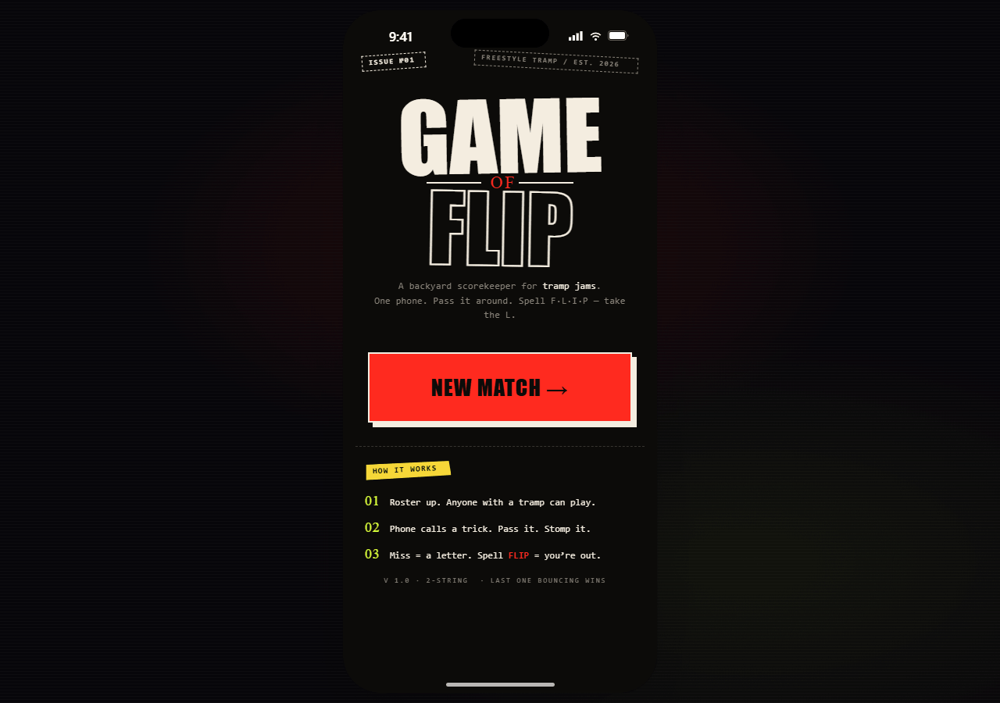
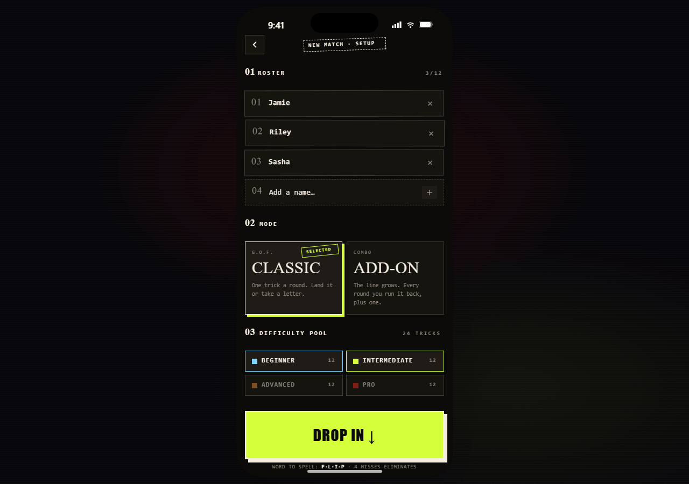
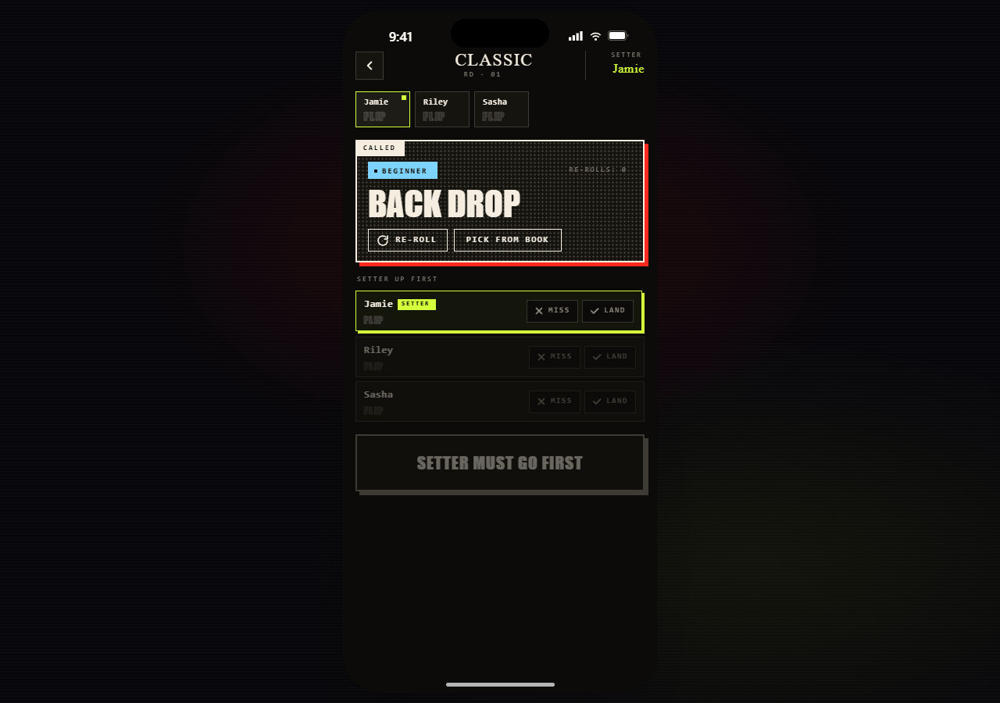
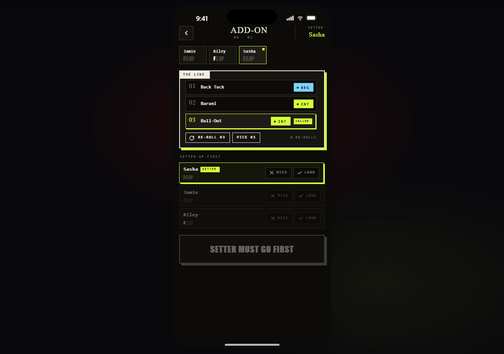
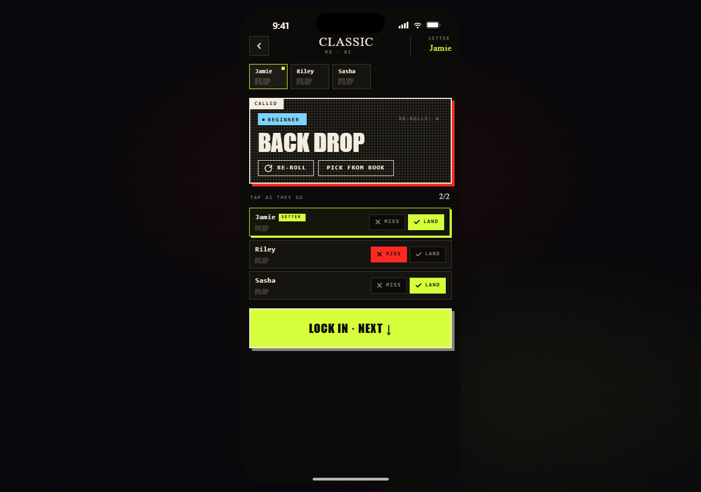
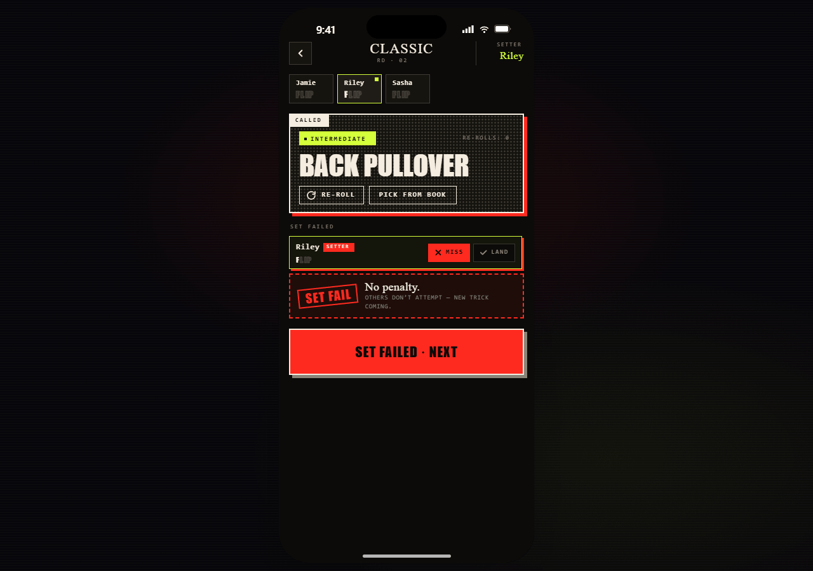
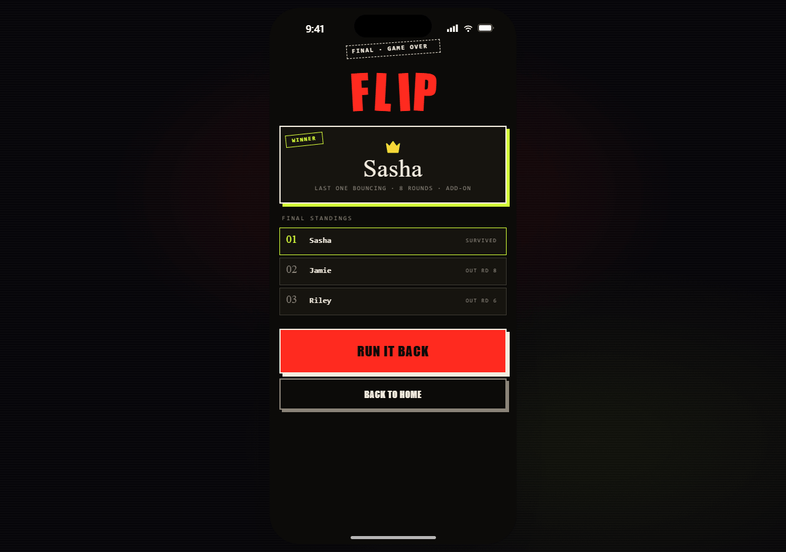

<h1 align="center">G·A·M·E&nbsp;·&nbsp;O·F&nbsp;·&nbsp;F·L·I·P</h1>

<p align="center">
  <strong>A backyard scorekeeper for freestyle trampoline.</strong><br/>
  One phone. Pass it around. Spell <code>F·L·I·P</code> — take the L.
</p>

<p align="center">
  <code>ISSUE №01</code> &nbsp;·&nbsp; <code>FREESTYLE TRAMP</code> &nbsp;·&nbsp; <code>EST. 2026</code>
</p>

<p align="center">
  
</p>

---

## What it is

Game of Flip is the trampoline cousin of **S·K·A·T·E** or **H·O·R·S·E**. The app rolls a trick from a curated library each round, players take turns attempting it, and you tap their result. Miss enough times to spell the loss word — last one bouncing wins.

Two modes:

- **CLASSIC** — one trick per round, single attempt.
- **ADD-ON** — the line grows. Each round players run the established combo plus a new trick. Drop one, take a letter.

---

## Look at it

<p align="center">
  
  
  
</p>
<p align="center">
  
  
  
</p>

---

## Features

- **Classic** + **Add-On** modes with their own state-machines
- Setter rotates through alive players each round; gated other-player rows until setter resolves
- **Set-failed** flow with the no-penalty rule (failed set just rolls a fresh trick)
- Up to **12 players**, four-tier difficulty pool (Beginner → Pro)
- **Mid-match settings** sheet — change the difficulty pool without leaving the round
- **Trick picker** modal — search the library, hand-pick a trick instead of rolling
- **Pause-proof.** In-progress matches persist via AsyncStorage; kill the app, pick up where you left off
- **80-trick bundled library** with runtime refresh from a **published Google Sheet** — edit the sheet, the app pulls new tricks on next launch
- Pure local-first. No accounts. No server. No telemetry.

---

## Run it

```sh
git clone git@github.com:2020wmarvil/GameOfFlip.git
cd GameOfFlip
npm install
npx expo start --tunnel
```

Scan the QR with **Expo Go** on iOS or Android. If you're on the same Wi-Fi as the dev machine and your firewall lets `node` through, plain `npx expo start` (LAN mode) is faster — but tunnel mode never fails.

---

## Editing the trick library

The app reads its trick list from a **published Google Sheet** at runtime, with an AsyncStorage cache and a bundled fallback. To change the master list:

1. Open the sheet linked in [`src/data/tricksRemote.ts`](src/data/tricksRemote.ts)
2. Edit, add, or remove rows. Each row is `name` + `tier` (one of `beginner` / `intermediate` / `advanced` / `pro`).
3. Wait ~2 minutes — Google's CDN caches the published CSV briefly.
4. Cold-reload the app. New tricks roll on the next round and appear in the picker.

If the sheet is unreachable, the app falls back to the **cached snapshot** (last successful pull). If there's no cache either, it uses the bundled 80-trick library in [`src/data/tricks.ts`](src/data/tricks.ts). It always has tricks to roll.

---

## Round flow

1. **Round opens** — a trick is rolled from the filtered tier pool. Setter row enabled. Other rows gated at 0.4 opacity.
2. **Setter MISS** → `SET FAIL` banner replaces the gated rows. Tap **Set Failed · Next** → new trick rolls, setter rotates, **no letters applied**. Combo doesn't grow (Add-On).
3. **Setter LAND** → other rows ungate. Footer evolves: `Mark some scores` → `Skip Rest · Next` → `Lock In · Next ↓`.
4. **Lock In** → every non-setter who marked MISS takes a letter. Reach `word.length` letters and you're out.
5. **Last player alive** → Game Over. Winner card, standings ranked by elimination round, Run It Back or Back to Home.

Setter rotation only cycles through alive players.

---

## Project layout

```
src/
├── data/
│   ├── tricks.ts                bundled library + active mutable singleton
│   └── tricksRemote.ts          CSV parser + Sheet fetch + validation
├── store/
│   ├── match.ts                 reducer + State / Action types
│   ├── MatchContext.tsx         match state, AsyncStorage persistence
│   └── TrickLibraryContext.tsx  cache → fetch → fallback chain
├── ui/                          shared zine primitives
│   ├── BigStamp · ChunkyBtn · FlipLetters · GaffeTape
│   ├── GrainLayer · Halftone · Icon · StampLabel
│   └── TierBadge · TierToggle
├── screens/
│   ├── HomeScreen · SetupScreen · MatchScreen · GameOverScreen
│   └── MatchSettings · TrickPicker
└── theme/
    └── tokens.ts                colors, fonts, type scale, spacing
App.tsx                          font loading, provider wiring, ActiveScreen router
```

The reducer in `src/store/match.ts` is the source of truth for match state. All side effects (persistence, remote loading) sit at the context boundary.

---

## Built with

- **React Native** + **Expo SDK 54** · TypeScript (strict)
- **Anton** + **Space Mono** via `@expo-google-fonts`
- **react-native-svg** for outlined typography, icons, halftone, and procedural grain
- **AsyncStorage** for in-progress match persistence and library caching
- **EAS** for build and submission ([`eas.json`](eas.json))

---

<p align="center">
  <em>v 1.0 · 2-string · last one bouncing wins</em>
</p>
